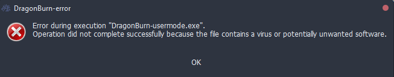
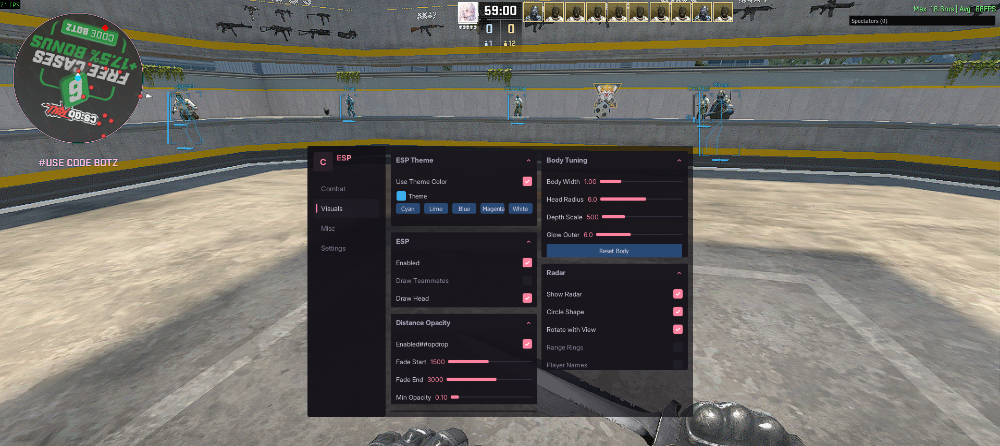

<p align="center"></p><p align="center">  
  
  
  
  
  
  
  
  
  
  
  
  
</p>

<h3>
<p align="center">
DragonBurn is one of the best CS2 kernel mode read only external cheats. It has a wide range of features, full customization, and automatic offset updates. Undetected by all anti-cheats except faceit.
</p></h3>

<p align="center">
<a href="https://github.com/some-random-guy-ah/DragonBurn-Community-Update/releases/tag/0.1">Download latest release</a><br>
⭐Please, star this repo if it was helpful⭐
</p>

---

### 🌐Join our community

<a href="https://discord.gg/5WcvdzFybD"></a>

<a href="https://ko-fi.com/bytecorum"></a>

---

### 📋Features

Press END key to open/close menu.

<details>
<summary>Visual</summary>
SOME OPTIONS WERE REMOVED
-   Box ESP
-   Box Type
-   Box Rounding
-   Filled Box ESP
-   Gradient Filled Box ESP
-   Skeleton
-   Snap Line
-   Sound esp
-   Bomb esp
-   Bomb carrier esp
-   Visual Color
-   Eye Ray
-   Health Bar
-   Armor Bar
-   Weapon
-   Ammo
-   Distance
-   Name
-   Scoped
-   Blind
-   Blind Hide
-   AWP Crosshair
-   Visual Preview
-   etc
</details>

<details>
<summary>Radar Hack</summary>

-   Point Size
-   Proportion
-   Range
-   Alpha
</details>

<details>
<summary>Aimbot</summary>

-   Start Bullet
-   Aim Lock
-   Draw Fov
-   Visible Check
-   Auto Only
-   Flash Check
-   Scope Check
-   Humanization
-   FOV
-   Smooth
-   Multi Hitboxes Selection
</details>

<details>
<summary>RCS</summary>

-   Yaw
-   Pitch
-   Preview
</details>

<details>
<summary>Trigger Bot</summary>

-   Scope Check
-   Flash Check
-   Stop Check
-   Shot Delay
-   Shot Duration
-   TTD
</details>

<details>
<summary>Misc</summary>

-   Bomb Timer
-   Bunny Hop
-   Head Line
-   Hit Sound
-   Hit Markers
-   Auto knife
-   Auto zeus
-   Auto accept
-   Spectator list
-   Watermark
-   Anti Record
</details>

---

### 🛠️How to use

At the beginning, download latest release or compile project by yourself. You need only 2 files `DragonBurn.exe` and `DragonBurn-kernel.exe`.

> [!NOTE]
> Kernel driver is closed-source for safety reasons. Please download the compiled binary from the releases.

Once downloaded, run `DragonBurn-kernel.exe` to map the driver. If u see `[+] success` all fine, then just run `DragonBurn.exe` and gl hf.

---

### ❌Errors



> Error: `Windows Defender, other antivirus programs, or anti-cheats may flag cheat as virus`
>
> Solution: Turn off real-time protection

---

### ❌Mapper errors

cmd should be opened as admin

> Error: `[x] Kernel-mode driver image is empty`
>
> Solution: Fill `std::vector<uint8_t> image = {};` in `cfg.h` with kernel binaries

> Error: `[x] \Device\Nal is already in use.`
>
> Solution: Use [NalFix](https://github.com/VollRagm/NalFix)

> Error: `[x] Your vulnerable driver list is enabled and have blocked the driver loading`
>
> Solution: Disable vulnerable driver list, [official solution](https://support.microsoft.com/en-au/topic/kb5020779-the-vulnerable-driver-blocklist-after-the-october-2022-preview-release-3fcbe13a-6013-4118-b584-fcfbc6a09936)

> Still getting: `[x] Failed to register and start service for the vulnerable driver`
>
> Solution: Turn off all antiviruses and all anti-cheat clients, usually caused by faceit anti-cheat
>
> Faceit: `sc stop faceit`
> Vanguard: `sc stop vgc` `sc stop vgk`

<!--
> Error: `Driver is mapped successfully but failed to connect to kernel`
>
> Solution: Reboot pc and manually run mapper with `--legacymethod`
-->

> [!TIP]
> These cmds should fix any issues (after executing restart pc):
>
> ```
> reg add \"HKLM\SYSTEM\CurrentControlSet\Control\DeviceGuard\Scenarios\HypervisorEnforcedCodeIntegrity\" /v Enabled /t REG_DWORD /d 0 /f
>
> reg add \"HKLM\SYSTEM\CurrentControlSet\Control\Lsa\" /v RunAsPPL /t REG_DWORD /d 0 /f
>
> reg add \"HKEY_LOCAL_MACHINE\System\CurrentControlSet\Control\DeviceGuard\" /v EnableVirtualizationBasedSecurity /t REG_DWORD /d 00000000 /f
>
> bcdedit /set hypervisorlaunchtype off
>
> reg add \"HKEY_LOCAL_MACHINE\SYSTEM\CurrentControlSet\Control\CI\Config\" /v VulnerableDriverBlocklistEnable /t REG_DWORD /d 00000000 /f
> ```

---

### 🖼️Preview

<p align="center">

</p>

<p align="center">

</p>

<p align="center">

</p>

---

### 📲Contacts

<a href="https://github.com/ByteCorum"></a>
<a href="https://discordapp.com/users/798503509522645012"></a>

---

### 💸Support

<a href="https://ko-fi.com/bytecorum"></a>

---
